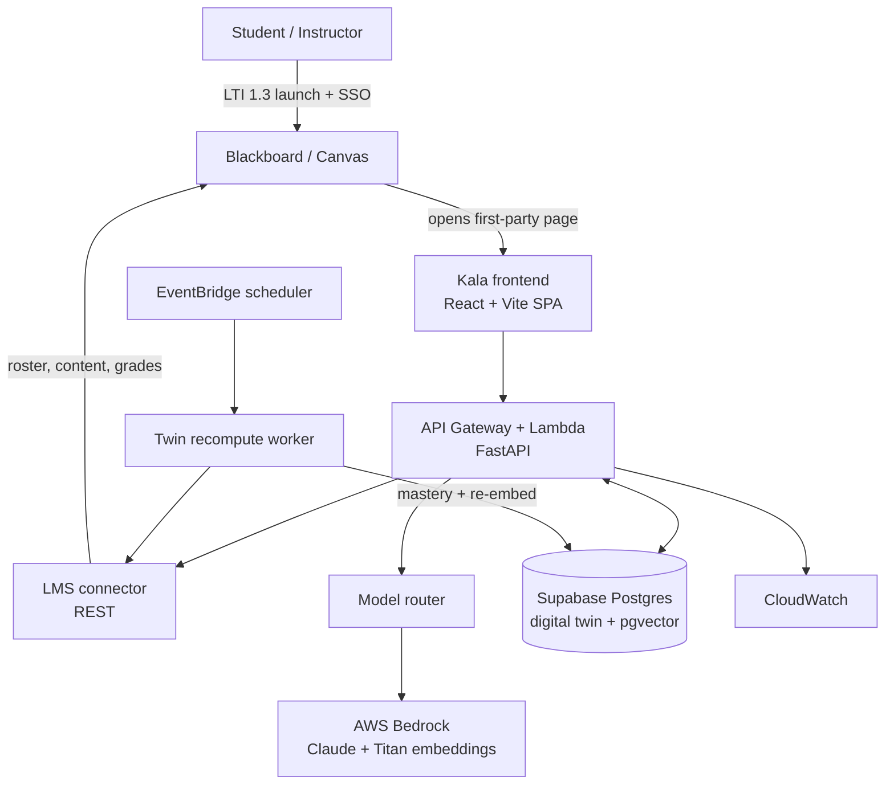

# Kala Masterplan

**Kala: an AI learning companion and digital learning twin, delivered as an intelligence layer on top of the LMS.**

Pilot institution: Mapua Malayan Colleges Mindanao (MMCM), College of Engineering and Architecture (CEA).
Vehicle: OJT build plus the 2026 Cintana Alliance AI Challenge.
Hard demo deadline: **September 1**.

This document is the single source of truth for what we are building, why, and in what order. It is written to be read by a small dev team setting up the project from an empty repo.

---

## 1. What Kala is (and is not)

Blackboard and Canvas are **systems of record**. They store courses, content, submissions, and grades. They do not model how a student learns, they do not measure mastery over time, and they cannot tell a teacher who is quietly falling behind or why.

Kala is the **system of insight** that sits on top of them. We do not host courses and we do not become a second source of truth for content. We read the LMS as the source of truth, and we produce the one thing the LMS structurally cannot: a longitudinal, Bloom's-aligned model of each learner (the "digital twin"), plus the early-warning analytics teachers need to act on it.

Because we integrate through open standards (LTI 1.3 and REST), the same intelligence layer works across every institution in the Cintana Alliance regardless of which LMS they run.

**One-line positioning:** Blackboard and Canvas record learning; Kala measures it.

### What changed from the first prototype
The first iteration was a standalone board-exam reviewer with its own course-code enrollment (CodeChum style). That competes with the LMS, is hard to scale, and duplicates content. We are retiring the standalone enrollment model. Kala now reads courses, rosters, and assessments from the LMS and layers intelligence on top. The existing screens (login, course workspace, diagnostic, quick practice, flashcards, AI tutor) are reused; only the context source and the outputs change.

---

## 2. Cintana alignment

Map every design decision back to the four judging criteria:

- **Creativity and originality:** a measurement and intervention layer, not another content app. The digital twin plus Bloom's mapping is the novel contribution.
- **Feasibility and implementation potential:** we wrap infrastructure that already exists rather than rebuilding an LMS. A working prototype already exists.
- **Educational impact:** measurable learning gains, plus teacher early-warning that enables timely intervention.
- **Scalability across institutions:** standards-based and LMS-agnostic. The same tool serves any Cintana institution on Blackboard or Canvas.

Keep responsible-AI framing visible: student learning data is sensitive, we de-identify before any external model call, and we align recommendations to a recognized pedagogical framework (Bloom's Revised Taxonomy) rather than a black box.

---

## 3. Scope

### 3.1 September 1 demo (must-have core)
1. LTI 1.3 launch with SSO from inside a live LMS course into Kala as a first-party page.
2. Roster pulled via LTI Names and Roles (NRPS).
3. One course's content and assessments pulled via REST and tagged to a skill taxonomy with Bloom's levels.
4. Diagnostic, quick practice, and AI tutor running on that real course content (RAG-grounded).
5. A live-updating student digital twin (mastery per skill, evidence log).
6. An instructor dashboard: skills-by-Bloom's heatmap plus an at-risk list.
7. LMS-agnostic connector interface with a working Blackboard implementation. (Canvas access was removed at the vendor level — the interface stays LMS-agnostic, and a Canvas connector is future work.)

### 3.2 Strong nice-to-have (include if time allows)
- Grade or completion passback to the LMS gradebook via LTI Assignment and Grade Services (AGS).
- Lightweight gamification tied to the twin (XP, streaks, mastery badges).
- A basic researcher export of anonymized, aggregated evidence.

### 3.3 Future work (name it in the proposal, do not build for September)
- NotebookLM-style automatic diagram generation from course material as a learning aid.
- Text-to-audio (spoken explanations and summaries).
- Multi-modal content generation across text, visual, practice, and audio.
- Deep knowledge tracing (a trained model) replacing the heuristic tracer.
- Full Canvas parity and additional LMS connectors.
- **Roster reconciliation via NRPS** — the LMS roster is the source of
  truth for who is enrolled; the LTI launch handler upserts an enrollment
  row on every launch, so a test-launcher account (or a co-teacher's
  mis-mapped role claim) that launches a course writes a real enrollment
  row the roster then reports. A scheduled sync that compares DB
  enrollments against the NRPS roster and removes rows the LMS does not
  list would fix this class of drift permanently. Deliberately not built:
  the September-1 data hygiene problem it solves was a one-time cleanup,
  and a sync job is new infrastructure days before a deadline. Tracked
  here instead (added 09/01).

> Note on "learning styles": the VARK "match teaching to a learner's style" claim is not well supported by evidence. Frame multi-modal support as offering the same concept in several representations (text, diagram, practice, audio) so learners can choose, not as detecting and matching a fixed style. This keeps the research defensible.

---

## 4. Architecture overview

Users enter through the LMS. An LTI 1.3 link opens Kala as a first-party page on Vercel. The frontend calls an API Gateway plus Lambda (FastAPI) backend, which fans out to three things: an LMS connector that reads the LMS over REST, a model router that calls Bedrock, and a Supabase Postgres plus pgvector store that holds the digital twin and the RAG index. An EventBridge schedule drives an async worker that recomputes mastery and re-embeds changed content. CloudWatch handles logs and alarms.



### Request path vs async path
- **Synchronous** (student asks the tutor, submits practice, loads a dashboard): frontend to API Gateway to Lambda, straight through. No EventBridge here.
- **Asynchronous** (sync new attempts and grades, recompute the twin, re-embed content): EventBridge Scheduler triggers the worker Lambda on a cadence. Add SQS in front if buffering is needed. This is the only place EventBridge belongs.

---

## 5. LMS integration design

### 5.1 Two standards, two jobs
- **LTI 1.3 / LTI Advantage** is the front door: the clickable placement inside the LMS (the same mechanism Turnitin uses). It gives us SSO, launch context (course, user, role), Names and Roles (roster), Assignment and Grades (grade passback), and Deep Linking.
- **REST API** is the data pipe: after an LTI launch we obtain an OAuth token and read course content, assessment columns, attempts, and grades to feed the twin.

The Anthology docs explicitly recommend combining both. Do that.

### 5.2 Launch experience decision: full page, not iframe modal
Turnitin renders inside an iframe overlay. Do not copy this for Kala. Modern browsers partition storage and block third-party cookies inside iframes, which breaks sessions for a rich SPA. Instead:

1. The LTI link launches and we validate the launch.
2. We set a **first-party** session cookie for the Kala domain.
3. Kala opens as a full page (new tab or top-level navigation), already signed in and scoped to the launch context.

Optional later: a small embedded placement card in the LMS that deep-links out to Kala. Not needed for September.

### 5.3 The connector abstraction (this is the "agnostic framework")
Define one interface and implement it per LMS. This interface is also a clean engineering artifact for the OJT writeup and the research paper.

```python
class LMSConnector(Protocol):
    def launch_context(self, id_token: dict) -> LaunchContext: ...
    def get_roster(self, course_id: str) -> list[Member]: ...        # via NRPS
    def get_course_content(self, course_id: str) -> list[ContentItem]: ...
    def get_assessments(self, course_id: str) -> list[Assessment]: ...
    def get_attempts(self, course_id: str, user_id: str) -> list[Attempt]: ...
    def push_grade(self, line_item: str, user_id: str, score: float) -> None: ...  # via AGS
```

- `BlackboardConnector`: implement fully for September.
- `CanvasConnector`: kept as a stub to prove the interface is LMS-agnostic. Canvas access was removed at the vendor level; full implementation is future work if a Canvas tenant onboards.

### 5.4 Registration and tokens (build notes)
- Register a REST application and an LTI 1.3 tool in the Anthology Developer Portal. Registration yields a client id, and the platform validates our messages against our public key published at a **JWKS URL** (we generate our own key pair; RS256).
- Use a maintained Python LTI 1.3 library (for example `pylti1.3`) rather than hand-rolling the OAuth and JWT handshake. Reference Blackboard's public sample tool provider for the flow.
- Keep the **LTI launch handler always warm** (a small Fargate or App Runner container, or provisioned-concurrency Lambda). Launch handshakes are redirect-heavy and cold starts make them flaky.
- For production, the developer holds one app id/key/secret and the institution installs it. Developers are limited to non-production testing environments.

---

## 6. The digital twin (the core contribution)

Spend design energy here. Three layers.

### 6.1 Skill graph (per course)
A list of competencies or topics, each tagged with a Bloom's Revised Taxonomy level (Remember, Understand, Apply, Analyze, Evaluate, Create). Seed it by having an LLM read LMS content, the syllabus, and (for board readiness) the exam blueprint, then classify each content item and question to a skill and a Bloom's level. This content-to-skill tagging is itself a demoable AI use and it grounds everything else.

### 6.2 Mastery state (per student, per skill)
A mastery estimate that updates as evidence arrives. For September, do **not** promise a trained deep knowledge-tracing model we cannot validate in time. Use one of:
- **Bayesian Knowledge Tracing (BKT):** four parameters per skill (prior, learn, guess, slip). Transparent and standard in the literature.
- **Elo-style update with recency decay:** even simpler, updates in real time.

Track per skill: attempts, correctness, response latency, hint usage, recency (spacing). Name deep KT as future work.

### 6.3 Evidence log (append-only)
Every diagnostic answer, practice attempt, tutor exchange, and flashcard grade is an immutable event that feeds the mastery state. This log powers pain-point detection **and** is the research dataset.

- **Pain-point detection** falls out of the log: skills where mastery is low while attempts and hint usage are high, or a Bloom's level where the student plateaus.
- **Board readiness** is a blueprint-weighted rollup of mastery across skills.

---

## 7. AI layer

### 7.1 Model router (tiered by cost and risk)
Route each request to the cheapest model that can do the job safely. This protects against abuse, rate limits, and cost.
- **Tier 1 (most traffic):** a cheap default model for general Q and A, RAG answers, summaries, classifications, and hints.
- **Tier 2 (escalation):** a mid model for harder reasoning.
- **Tier 3 (reserved, small share):** a premium model for the hardest cases.

Prefer keeping Tier 2 and Tier 3 on **AWS Bedrock** so everything lives in the school-governed AWS org account (clean billing and IAM governance story). External model providers add a second vendor and data egress; if used for Tier 1 cost savings, send only de-identified context and document the tradeoff.

> At build time, confirm exact model ids available in the target region rather than hardcoding names now, since availability and versions change. If a chosen model is not in-region, either switch region or use a cross-region inference profile.

### 7.2 RAG
- Embed LMS content into pgvector (Titan Text Embeddings or equivalent).
- Ground diagnostics, practice items, hints, and tutor answers in the student's actual course content. This resolves the "coherence with the same materials" question: our practice is generated **from** their course content, not a generic bank.

### 7.3 Privacy in AI calls
Send pseudonymous student ids and stripped context to any model, never names. Student learning data is sensitive under the Philippine Data Privacy Act. This is also good responsible-AI optics for Cintana.

---

## 8. Data model

Primary store: Supabase Postgres with Row Level Security, plus the `pgvector` extension. Keep PII in Postgres behind RLS.

Core tables (illustrative):

```
institutions        (id, name, lms_type, region)
courses             (id, institution_id, lms_course_id, title)
users               (id, institution_id, lms_user_id, role, pseudonym)
skills              (id, course_id, name, bloom_level, blueprint_weight, module_ref)
content_items       (id, course_id, lms_ref, skill_id, embedding vector,
                     parent_lms_ref, folder_path jsonb, module_ref)
assessments         (id, course_id, lms_ref, skill_id)
evidence_events     (id, user_id, course_id, skill_id, type, correct,
                     latency_ms, hints_used, created_at)          -- append-only
mastery_state       (user_id, skill_id, estimate, attempts, last_seen, updated_at)
readiness_snapshots (id, user_id, course_id, score, created_at)
recommendations     (id, user_id, skill_id, action, rationale, created_at)
```

- `evidence_events` is append-only. Never update or delete a row; it is the research dataset and the audit trail.
- `mastery_state` is derived from `evidence_events` by the tracer; it can be recomputed from scratch.
- `content_items.embedding` powers RAG retrieval.
- `folder_path` (ancestor chain, root → parent) and `module_ref` (top-level
  ancestor) scope content and skills to a course's own folder/module
  structure, derived generically from the LMS content tree (`lms/hierarchy.py`)
  — MMCM's `Module N` convention and any other Cintana school's deeper
  nesting both fall out of the same parent_id walk, no naming assumed.

---

## 9. User flows and pages

### 9.1 Student
1. Inside the LMS course, clicks the Kala link (LTI placement).
2. LTI launch signs them in and opens Kala scoped to that course. No login screen.
3. First visit: a diagnostic builds the baseline (the "Build your baseline" screen).
4. Ongoing: topic focus, quick practice, flashcards, AI tutor. Each interaction writes an `evidence_event`.
5. A twin/readiness view shows their own mastery and pain points.
6. Optional: completion or mastery pushed back to the LMS gradebook via AGS.

### 9.2 Instructor
1. Same launch, instructor role routes to a class dashboard.
2. Skills-by-Bloom's heatmap for the cohort.
3. At-risk list (the early-warning signal the LMS cannot produce).
4. Per-student drill-down into the twin, with suggested interventions.

### 9.3 Admin (institution)
1. One-time: install Kala's LTI and REST application, configure the connector.
2. Map course content to the skill taxonomy; configure roster sync.

### 9.4 Researcher
1. Separate portal with its own login (not an LTI launch, since it is not tied to a course).
2. Query anonymized, aggregated evidence for pedagogy research; export datasets.

### Pages inventory
Reused from the existing prototype: login (now LTI-driven), course workspace, diagnostic, quick practice, flashcards, AI tutor chat.
New for the pivot: instructor class dashboard, student twin/readiness view, admin connector-and-mapping screen, researcher portal.

---

## 10. Gamification and learning modalities

### 10.1 Gamification (some is feasible for September)
Tie rewards to the twin so they mean something, not vanity points:
- XP earned for evidence that moves mastery, not for raw activity.
- Streaks for spaced, consistent practice (reinforces good spacing).
- Mastery badges per skill and per Bloom's level.
- A readiness progress bar rolled up from mastery.

Keep the reward logic server-side (in the API), driven by `evidence_events`, so it cannot be gamed from the client and stays consistent with the twin.

### 10.2 Learning modalities (mostly future work)
The "NotebookLM for assisted learning" description fits: the same concept rendered as text, as an auto-generated diagram, as practice, and (later) as audio. For September, ship text plus practice plus (if cheap) a simple generated visual. Scope automatic diagram generation and text-to-audio as future work in the proposal.

---

## 11. Tech stack

- **Frontend:** React + Vite SPA (first-party page), TanStack Router, TanStack Query, Zustand for UI state. Reuse existing UI. See `stack.md` (authoritative for frontend and dev-stack choices).
- **API:** FastAPI on AWS Lambda behind API Gateway; LTI launch handler kept warm (Fargate/App Runner or provisioned concurrency).
- **AI:** AWS Bedrock (Claude family for generation and reasoning, Titan for embeddings) behind a model router; optional external Tier 1 for cost.
- **Data:** Supabase (managed Postgres with RLS, `pgvector`, storage).
- **Async:** EventBridge Scheduler plus a worker Lambda (SQS optional).
- **Observability:** CloudWatch (logs, alarms, budget alerts).
- **Governance:** school-provided AWS org account, AWS IAM, single region (ap-southeast-1 for PH latency; confirm Bedrock model availability there).

---

## 12. Suggested repository structure

```
kala/
  apps/
    web/                 # React + Vite SPA (see stack.md)
  services/
    api/                 # FastAPI (Lambda) - request path
      routers/           # tutor, practice, diagnostic, dashboard
      lti/               # launch, JWKS, session
      connectors/        # LMSConnector, blackboard.py, canvas.py
      ai/                # model_router, rag, prompts
      twin/              # tracer (BKT/Elo), pain_points, readiness
    worker/              # async twin recompute + re-embed (Lambda)
  packages/
    schema/              # shared types, pydantic models
    db/                  # migrations, RLS policies
  infra/                 # IaC (AWS): API GW, Lambda, EventBridge, IAM
  docs/
    masterplan.md
    architecture.md
  README.md
```

---

## 13. Development environment setup

The biggest schedule risk is external dependency: getting LMS access depends on your professors and on Anthology. Do not let the demo hinge on it. Two moves remove the risk.

1. **Stand up your own Blackboard dev instance.** Sign up for the free Anthology Community developer tier and deploy a Blackboard Learn developer image (published as a VMDK, converted to an AMI) in the school-provided AWS org account. This is a real Learn Ultra environment to build LTI and REST against, with no waiting. The dev license is time-boxed (about 90 days), which fits the September timeline.
2. **Keep a Canvas free teacher account** as a parallel target. Access is instant, and the connector is meant to be agnostic anyway. If the school's Blackboard sandbox slips, demo on the Learn AMI or on Canvas; the story is identical.

Setup checklist:
- [ ] AWS org account access confirmed; billing routed to school; IAM roles created.
- [ ] Anthology Community developer account created.
- [ ] Blackboard Learn developer AMI running in AWS (or Canvas free account ready).
- [ ] Request admin access to the school's Blackboard sandbox from professors (parallel track, not blocking).
- [ ] Register LTI 1.3 tool and REST app in the Developer Portal; publish JWKS URL.
- [ ] Supabase project created; `pgvector` enabled; RLS policies drafted.
- [ ] Bedrock model access enabled in the target region; note the exact model ids.
- [ ] Vercel project connected to the web app.

---

## 14. Build phases (to September 1)

Roughly weekly milestones. Compress or reorder as needed.

**Phase 0, foundation.** AWS access, dev LMS running, repo scaffolded, Supabase and Bedrock enabled, CI to Vercel. Deliverable: an empty Kala page reachable from a real LMS via a raw LTI launch.

**Phase 1, launch and identity.** LTI 1.3 launch validated, first-party session set, role-based routing (student vs instructor). NRPS roster pull. Deliverable: click the LMS link, land in Kala signed in, see the class roster.

**Phase 2, ingest and tag.** REST pull of one course's content and assessments. LLM tags content to skills and Bloom's levels; embeddings written to pgvector. Deliverable: a seeded skill graph for one real course.

**Phase 3, learn loop.** Diagnostic, quick practice, AI tutor, all RAG-grounded on real content. Every interaction writes `evidence_events`. Tracer (BKT or Elo) updates `mastery_state`. Deliverable: a student can study and the twin updates live.

**Phase 4, insight.** Instructor heatmap and at-risk list; student twin/readiness view; recommendations. Deliverable: the pitch-critical instructor dashboard.

**Phase 5, polish and de-risk.** Model router tiers finalized; optional AGS grade passback; optional gamification; Canvas stub; rehearsal and fallback demo recorded. Deliverable: a demo that runs even if live access fails.

Record a backup demo video before September 1 so a live failure never sinks the presentation.

---

## 15. Security, privacy, compliance

- Keep PII in Postgres behind Row Level Security; scope every query to the launching user and course.
- De-identify before any model call (pseudonyms, stripped context).
- Do not put personal or sensitive data in URL parameters.
- Prefer Bedrock in-account for governed data; document any external model egress.
- Align with the Philippine Data Privacy Act; get a data-handling sign-off from the school before the pilot with real students.
- Do not perform prohibited actions automatically (no auto-submitting forms, no auto-posting grades without an explicit configured line item and instructor consent).

---

## 16. Research and evaluation plan

Reuse the existing CRISP-DM framing.
- **Business and data understanding:** learner and educator needs for personalized review, intervention, and board readiness.
- **Data:** diagnostic scores, practice results, mastery changes, completion, engagement, all from `evidence_events`.
- **Modeling:** heuristic knowledge tracing (BKT or Elo) plus LLM generation and classification.
- **Evaluation:** a small pilot with pre and post diagnostic scores, mastery change, engagement, and a System Usability Scale (SUS) survey, analyzed with descriptive statistics.
- **Metrics:** learning outcomes (pre/post improvement, mastery progression, gap reduction, readiness), engagement (sessions, completion, time on task, return rate), personalization (recommendation relevance and acceptance), twin performance (profiling accuracy, gap-identification accuracy, predicted vs observed alignment), user experience (SUS, usefulness, trust), educator impact (at-risk learners identified, intervention insights generated), startup validation (adoption, retention, institutional interest).

---

## 17. Risks and mitigations

- **LMS access delayed.** Mitigation: own Blackboard dev AMI plus Canvas fallback; request school sandbox in parallel, not on the critical path.
- **Iframe cookie breakage.** Mitigation: full first-party page, not an iframe modal.
- **LTI cold-start flakiness.** Mitigation: keep the launch handler warm.
- **Overpromising the ML.** Mitigation: ship transparent heuristic tracing; name deep KT as future work.
- **Scope creep from gamification and multimodal.** Mitigation: fixed September core; audio and auto-diagrams are future work.
- **Data privacy.** Mitigation: RLS, de-identification, school sign-off before real-student pilot.

---

## 18. Open decisions

Track these as they get resolved:
- [x] Module scoping: **resolved** — derived from each course's own top-level
  content folders (generic over depth/naming), stored as
  `folder_path`/`module_ref` (migration 0006, `app/lms/hierarchy.py`),
  with optional `module_ref` filters on heatmap and diagnostic plus a
  `GET /courses/{id}/modules` endpoint for admin sanity checks. An
  in-app skill/module curation screen (the metadata-driven exception) is
  deferred past September 1.
- [x] Canvas connector: **resolved** — access removed at the vendor level;
  stub retained to prove interface agnosticism, full implementation future
  work.
- [ ] Blackboard sandbox vs own AMI as the primary demo target.
- [ ] Tier 1 model: Bedrock-only vs external provider for cost.
- [ ] BKT vs Elo for the September tracer.
- [ ] AGS grade passback in September or deferred.
- [ ] Exact Bedrock model ids and region.
- [ ] Whether the researcher portal ships in September or is stubbed.
